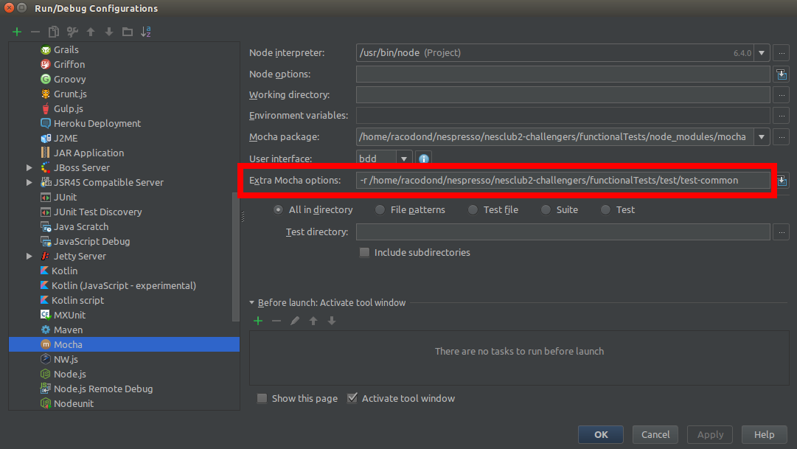

# Nestle Test Automation Framework

## Test Project Structure

This structure is generated when intializing a new test project running the `npx ntaf install` command. See the
[technical documentation](https://github.com/nespresso/ntaf#adding-ntaf-package-and-configuration-to-your-project) for
more details.

**conf/** Configuration  
|&nbsp;&nbsp;&nbsp;&nbsp;&nbsp;+-- **realm/** Realm configuration files  
**doc/** Documentation  
|&nbsp;&nbsp;&nbsp;&nbsp;&nbsp;+-- **Framework.md** This documentation  
**log/** Log files (Selenium, browser, etc.)  
**node_modules/** All dependencies (node modules) installed via `npm install`  
**output/** Test execution reports such as JUnit, Allure, etc. reports  
|&nbsp;&nbsp;&nbsp;&nbsp;&nbsp;+-- **errorShots/** Error screenshots taken when scenarios have failed  
**src/** All source code  
|&nbsp;&nbsp;&nbsp;&nbsp;&nbsp;+-- **features/** Scenarios written in Gherkin  
|&nbsp;&nbsp;&nbsp;&nbsp;&nbsp;+-- **step-definitions/** Translation of the Gherkin scenarios  
|&nbsp;&nbsp;&nbsp;&nbsp;&nbsp;+-- **support/** Source code implementing step definitions  
|&nbsp;&nbsp;&nbsp;&nbsp;&nbsp;&nbsp;&nbsp;&nbsp;&nbsp;&nbsp;+-- **business-object/** Implementing business flows  
|&nbsp;&nbsp;&nbsp;&nbsp;&nbsp;&nbsp;&nbsp;&nbsp;&nbsp;&nbsp;+-- **component-object/** Parts of the page objects that are reused on several pages  
|&nbsp;&nbsp;&nbsp;&nbsp;&nbsp;&nbsp;&nbsp;&nbsp;&nbsp;&nbsp;+-- **data/** Containing data objects that are data sets for each scenario  
|&nbsp;&nbsp;&nbsp;&nbsp;&nbsp;&nbsp;&nbsp;&nbsp;&nbsp;&nbsp;+-- **helper/** Any other pieces of code that help make the code more readable  
|&nbsp;&nbsp;&nbsp;&nbsp;&nbsp;&nbsp;&nbsp;&nbsp;&nbsp;&nbsp;+-- **page-object/** Page objects (see [design pattern](http://www.assertselenium.com/automation-design-practices/page-object-pattern/))  
|&nbsp;&nbsp;&nbsp;&nbsp;&nbsp;&nbsp;&nbsp;&nbsp;&nbsp;&nbsp;+-- **hooks.js** Cucumber.js [hooks](https://github.com/cucumber/cucumber-js/blob/master/docs/support_files/hooks.md)  
|&nbsp;&nbsp;&nbsp;&nbsp;&nbsp;&nbsp;&nbsp;&nbsp;&nbsp;&nbsp;+-- **world.js** Global libs and helpers available for each scenario execution  
**test/** Unit tests  
**.gitignore** Files to be ignored by Git (logs, node_modules, etc.)  
**.jscsrcs** Configuration of the [JSCS linter](http://jscs.info/overview)  
**.npmrc** npm configuration specific to this project  
**package.json** npm configuration for the project, including dependencies. Used by npm on `npm install`  
**Readme.md** Getting started documentation  
**wdio.conf.js** webdriver.io configuration. Used by `npx ntaf run`  
**wdio.local.conf.js** webdriver.io configuration (inherits from wdio.conf.js) to run test locally. Used by `npx ntaf run wdio.local.conf.js`  
**wdio.debug.conf.js** webdriver.io configuration (inherits from wdio.local.conf.js) for debugging purposes. Used by `npx ntaf run wdio.debug.conf.js`

## Code structure

The framework follows the [Push how down](https://markoh.co.uk/posts/cucumber-best-practices-push-how-down) good practice
which consists in pushing the complexity as down as possible in the stack. A good example on how the complexity should
be pushed down can be found [here](http://www.spritecloud.com/2015/01/complex-workflows-with-cucumber/).

The different layers are the following (from top to bottom):

&nbsp;&nbsp;&nbsp;&nbsp;&nbsp;&nbsp;&nbsp;&nbsp;Gherkin Scenarios  
&nbsp;&nbsp;&nbsp;&nbsp;&nbsp;&nbsp;&nbsp;&nbsp;&nbsp;&nbsp;&nbsp;&nbsp;&nbsp;&nbsp;&nbsp;&nbsp;&nbsp;&nbsp;&nbsp;&nbsp;&nbsp;|  
&nbsp;&nbsp;&nbsp;&nbsp;&nbsp;&nbsp;&nbsp;&nbsp;&nbsp;Step Definitions  
&nbsp;&nbsp;&nbsp;&nbsp;&nbsp;&nbsp;&nbsp;&nbsp;&nbsp;&nbsp;&nbsp;&nbsp;&nbsp;&nbsp;&nbsp;&nbsp;&nbsp;&nbsp;&nbsp;&nbsp;&nbsp;|  
&nbsp;&nbsp;&nbsp;&nbsp;&nbsp;&nbsp;&nbsp;&nbsp;Business Objects  
&nbsp;&nbsp;&nbsp;&nbsp;&nbsp;&nbsp;&nbsp;&nbsp;&nbsp;&nbsp;&nbsp;&nbsp;&nbsp;&nbsp;&nbsp;&nbsp;&nbsp;&nbsp;&nbsp;&nbsp;&nbsp;|  
&nbsp;&nbsp;&nbsp;Page/Component Objects    

Each layer can only interact with the layer right below it:
* Step definitions can only interact with Business objects
* Business objects can only interact with Page/Component objects

Details of each layer are described below.

### Gherkin Scenarios

> Gherkin is a Business Readable, Domain Specific Language that lets you describe software’s behaviour without detailing
how that behaviour is implemented.

Example:
```Gherkin
Feature: Some terse yet descriptive text of what is desired
  Textual description of the business value of this feature
  Business rules that govern the scope of the feature
  Any additional information that will make the feature easier to understand

  Scenario: Some determinable business situation
    Given some precondition
      And some other precondition
    When some action by the actor
      And some other action
      And yet another action
    Then some testable outcome is achieved
      And something else we can check happens too
```

Please read the [Gherkin documentation](https://github.com/cucumber/cucumber/wiki/Gherkin) to learn the syntax.
It is fairly simple to understand and get started.

#### Best practices

1. Each scenario should be unitary and therefore should not rely on previously executed scenario(s) to pass.
2. Scenario should remain at a functional/business level, they should not make any reference to the web page: 

    **Bad, using CSS selectors**
    ```Gherkin
    When I open the login menu
      And I set #ta-header-username to john.doe@email.com
      And I set #ta-header-password to mypassword
      And I click on #ta-header-login-submit
    ```

    **Good**
    ```Gherkin
    When I login as john.doe@email.com/mypassword
    ```
    
    **Bad, describing web page layout**
    ```Gherkin
    Then I should see an error message on top of the page stating that the login/password is invalid
    ```
    
    **Good**
    ```Gherkin
    Then I should be told that I have provided wrong credentials
    ```

3. Make sure to target the feature that you want to test. The `When` steps should only describe the tested
feature/action. In the example below, we want to test the logout, not the login. The fact that the user is logged in
should be part of the test requirements (`Given` step), not part of the tested feature (`When` step). Thus, there should
be only one single `Ẁhen` step per scenario.

    **Bad**
    ```Gherkin
    Scenario Successful logout 
      Given I am on the homepage
      When I log in as john.doe@email.com/mypassword
      And I log out
      Then I should be a visitor
    ```
    
    **Good**
    ```Gherkin
    Scenario Successful logout 
      Given I am a customer
      When I log out
      Then I should be a visitor
    ```

4. Each step should be written with the tense related to the step type. Read this interesting [blog post](https://lizkeogh.com/2014/09/02/a-little-tense/).
    1. `Given` sentences should use the present or past (present perfect) tense to state the context.
    1. `When` sentences should use the present tense with an action verb to describe the actions.
    1. `Then` sentences should use the conditional tense to list assertions. They should start with `I should`.

        Examples:
        ```Gherkin
        Scenario: Unsuccessful login with invalid username
          Given I am a visitor
          When I log in as customer toto@email.com/password
          Then I should be a visitor
          And I should be told that I have provided wrong credentials
        ```

5. Each step should start with `I ...`

6. Features and scenarios should be tagged. Tagging provides the ability to only run a subset of features and/or scenarios.
Tags can be set to features and scenarios by adding `@tagname` on the line prior to `Feature` or `Scenario` keywords.

    The following tags are allowed:
    
    * `@smoke` (on scenarios only): To tag scenarios that are the most important from a business point of view. The
    objective is to run those scenarios before pushing any code to Stash and blocking the merge if some tests fail.
    * `@nrt` (on features and/or scenarios): To tag features/scenarios that should be run every night to guarantee that 
    developments from the previous day do not break any existing features.
    * `@feature` (on features only): To tag features related to the same functional area. For example: `@registration`,
    `@login`, etc. The objective is for the developer to be able to run tests related to the features he/she is updating to
    guarantee that he/she does not break anything.
    
    
    ```Gherkin
    @nrt @login
    Feature: Login / Logout from the user menu
    
      @smoke
      Scenario: Successful login with valid credentials
        Given I ...
    ```

#### Gherkin structure and useful sentences

##### Given

Always set the context in the following order:
 * Set the page from where to start the test case
   * `I am on the homepage`
   * `I am on the registration page`
   * `I am on the my account addresses page`
   * ...
 * Set the user
   * `I am a visitor` => When I should be a visitor, meaning not logged in.
   * `I am a customer` => When I should be a customer, meaning logged in, with no specific configuration.
   * `I am a customer who xxx` => When I should be a customer with specific configuration.
     * `I am a customer who has registered 2 addresses`
     * `I am a customer with products in my cart`
     * ...
 * Set other specific pieces of context   

##### When
 * `I go to the xxx page`
   * `I go to the homepage`
   * `I go to the registration page`
   * ...

##### Then
 * `I should be a visitor` => To assert that I should not be logged in.
 * `I should be a customer` => To assert that I should be logged in.
 * ...


### Step Definitions

Translation of each Gherkin sentence into executable JavaScript code.

Structure:
 * `Given` steps should contain actions to reach the required state for the test (functions that are action verbs)
   followed by assertions of those actions (functions starting with `see`)
 * `When` steps should only contain actions (functions that are action verbs)
 * `Then` steps should only contain assertions (functions starting with `see`)

Example:
```JavaScript
let customer = { firstName: 'John', lastName: 'Doe', email: 'john.doe@email.com' };

Given(/^I am customer (.+)\/(.+)/, function () {
  return browser
    .loginAs(customer.email, 'password')
    .seeCustomer();
});
      
When(/^I log in from (login page|menu) with valid credentials$/, function (location) {
  return login(location, { usernameField: 'login@email.com', passwordField: 'password' });
});
  
Then(/^I should be a visitor$/, function () {
  return browser.seeVisitor();
});
```

#### Best practices

1. Code should be understandable by anybody (not only developers). Thus, it should contain as few logic as possible.
Most of the logic should be hidden in business objects.
2. Step definitions should only interact with business objects, not with page/component objects.
3. Data set of scenarios should not be hard coded (use data files to be stored in the `src/support/data` folder instead).
4. Step definitions should not contain any technical assertions (such as `.should.eventually.be...`, 
 `.should.eventually.equal...`), the business objects should.
  
**Bad**
```JavaScript
When(/^I register without a machine$/, function () {
  browser
    .setValue('#ta-registration-firstName', 'Hillary')
    .setValue('#ta-registration-lastName', 'Trump')
    .click('#ta-continue-bottom');
});
```

**Good**
```JavaScript
When(/^I register without a machine$/, function () {
  const dataObject = require('src/support/data/registration/without-machine/us.data');
  return browser.register(dataObject);
});
```

Second piece of code is intelligible, data are not hard coded, it interacts only with a Business object and returns a
Promise.

### Business Objects

Objects that represent the core business. Methods should be as close as possible to the business, using the commonly
shared vocabulary.

Example:
```JavaScript
class User {
  
  constructor(userComponent, loginPage) {
    this.userComponent = userComponent;
    this.loginPage = loginPage;
  }

  // Action function
  login(data) {
    return this.userComponent.login(data);
  }

  // Assertion function
  async seeCustomerWithName(firstName, lastName) {
    const customer = await this.userComponent.getLoggedUser();
    return Promise.all([
      customer.firstname.should.equal(firstName),
      customer.lastname.should.equal(lastName),
    ]);
  }
  
  ...
}
```

#### Best practices

1. Action function should be an action verb
2. Assertion function should start with `see`
3. Add commands to the `browser` via `addCommand` [API](http://webdriver.io/api/utility/addCommand.html) to be able to
   easily chain promises in step definitions.
4. All technical assertions (such as `.should.eventually.be...`, `.should.eventually.equal...`) should be used in
   business objects only.
5. Handle [functional logging)(#logging)


### Page/Component objects

A page object represents a web page and define elements to interact with (e.g. fields, buttons...) and possible actions
(e.g. submit form).

A component object is similar to a page object but for parts of web page that are reused in several pages.

#### Best practices

1. Page/Component objects should not contain any technical assertions (such as `.should.eventually.be...`,
 `.should.eventually.equal...`), the business objects should.
2. Each page/component object should define a `pageElements` getter listing all the HTML elements that will be
  interacted with. Thus, a change in the web interface (id field change for instance) will only require a change in the 
  `pageElements` getter. All the HTML elements should be accessed through `pageElements`.
3. Functions returning the value of a page element should comply to the following naming convention: `getXXX`
4. Functions returning whether an object is visible or not should comply to the following naming convention:
   `isXXXVisible`
5. Functions just performing a single browser interaction should comply to the following naming convention:
  `clickXXXButton`, `clickXXXLink`, etc.
6. Functions performing several browser interactions should start with an action verb: `deleteSecondaryAddress`, 
  `addAddress`, etc.

## Logging

Even though the tests are automatically executed, it is important to be able to re-run them manually if needed.
Especially for investigation in case of failure.

In order to do this, a log file is generated in `log/functional-logs.log` for each execution.
Note that the file is re-created for each execution to not be polluted by previous runs.

The logging is done at the Business Object level, meaning all `browser.addCommand` should include the following logging:
```JavaScript
logger.info('Functional explanation of what is being executed.', {
  file: __filename, // This never changes
  method: 'browser.methodName',
});
```

Here is an example:
```JavaScript
/**
 * @alias Cart.proceedToCheckout
 * @memberOf browser
 * @method proceedToCheckoutFromMiniCart
 */
browser.addCommand('proceedToCheckoutFromMiniCart', function () {
  logger.info('Click on the "Proceed to checkout" button from the mini cart.', {
    file: __filename,
    method: 'browser.proceedToCheckoutFromMiniCart',
  });
  return cart.proceedToCheckoutFromMiniCart();
});
```

To log data (that is used to fill in form for instance), you can use `JSON.stringify`:
```JavaScript
/**
 * @alias FastRegistration.fastRegister
 * @memberOf browser
 * @method fastRegister
 */
browser.addCommand('fastRegister', function (data) {
  logger.info('Fast register with the following data:\n' + JSON.stringify(data, null, 2), {
    file: __filename,
    method: 'browser.fastRegister',
  });
  return fastRegistration.fastRegister(data);
});
```


## Technical Guidelines

### Additional browser commands

On top of the browser commands provided by WebdriverIO, additional commands are made available through the framework
such as `fillInForm` to automatically fill a form from a data object, `selectRadioButton`, etc. See
[documentation](https://nespresso.github.io/ntaf/) for more details.

### Faker

The [faker module](https://www.npmjs.com/package/faker) can be used to generate random and properly formatted data to
fill in forms.

The faker library can be accessed through the global `faker` object.
```JavaScript
const firstName = faker.name.firstName();
const lastName = faker.name.lastName();
```

### How to include modules

The [app-module-path module](https://www.npmjs.com/package/app-module-path) can be used to make all the path relative to the
root directory of your test project.

For instance to include `src/support/helper/helper.js`from any other file whatever its location, the syntax will always
be the same: `const helper = require('src/support/helper/helper');`

### Extensively use async / await

Extensively use [async / await](https://blog.risingstack.com/mastering-async-await-in-nodejs/) to make your code more
readable and maintainable.

### Unit Tests

#### What should be unit tested
 * All configuration and helper modules
 * All business objects; however, not all single functions should be tested. It is useless to test functions with no
 logic such as:
 ```JavaScript
seeVisitor() {
  return this.userComponent.isVisitor().should.eventually.be.true;
}

seeCustomer() {
  return this.userComponent.getLoggedUser().should.be.fulfilled;
}
```

But it is useful to test functions with logic such as:
```JavaScript
seeCustomerWithName(firstName, lastName) {
  const user = await this.userComponent.getLoggedUser();
  return Promise.all([
      user.firstname.should.equal(firstName),
      user.lastname.should.equal(lastName),
  ]);
}
```

#### How to unit test

##### Spying, stubbing, mocking

An interesting [blog post](http://jaketrent.com/post/sinon-spies-vs-stubs/) detailing how to use spies, stubs and mocks.
with the [Sinon](http://sinonjs.org/) library.
> * Use Spies - if you simply want to watch and verify somethings happens in your test case.
> * Use Stubs - if you simply want to specify how something will work to help your test case.
> * Use Mocks - if you want to both of the above on a single dependency in your test case.

Always use sandbox to set and reset the context through `beforeEach` and `afterEach`:
```JavaScript
let sandbox;

beforeEach(function () {
  sandbox = sinon.sandbox.create();
});

afterEach(function () {
  sandbox.restore();
});
```

##### Configuring IntelliJ to run unit tests
1. Install the `NodeJS` plugin
1. Update Mocha configuration to include the test-common file while running your tests. Go to Run >
Edit Configurations... > Defaults > Mocha and set the `Extra Mocha options` as follow:


